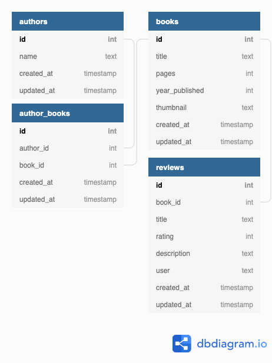

# Book Club
BE Mod 2 Paired Project
[Jalena Taylor](https://github.com/jalena-penaligon) and [Jon Peterson](https://github.com/joequincy)

### Background and Description
This purpose of this application is for users to browse and review books. The primary goal of this project is testing our ability to set up many-to-many relationships and accessing attributes through multiple models.

This project is a Mod 2 paired assignment from the [Turing School of Software and Design](https://github.com/turingschool). The project's assigned user stories can be found in this repo's [issues](https://github.com/joequincy/book-club/issues?utf8=%E2%9C%93&q=is%3Aissue+%22User+Story%22+in%3Atitle+created%3A%3C2019-03-21).

### Setup
A demo of this project is available [on Heroku](https://shielded-wave-53428.herokuapp.com/). The database is reset daily at 6pm UTC. If you would prefer to clone a local copy, please follow the steps below.

You will need [Bundler](https://bundler.io/). From the project root, run:
- `bundle install`
- `rake db:{create,migrate,seed}`
- `rails s`

Visit `localhost:3000` in your web browser.

### Learning Goals for this Project
- creation of a basic Rails web application
- implementing basic MVC structure
- save and retrieve data from a database
- display content on a web page with some very basic styling
- learning how to test code effectively at a Controller and a Model level

### Requirements
- must use Rails 5.1.x
- must use PostgreSQL
- all controller and model code must be tested via feature tests and model tests, respectively
- must use some amount of HTML and CSS layout
- project is hosted on Heroku

### Schema

